# DjangoProject
## Task-1 Screen shots:
1. Create a Virtual Environment: DjangoAssignment, and activate

    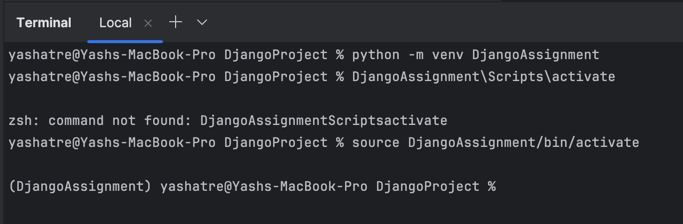
2. Install Django

    
3. Start project and setuo of the app.

    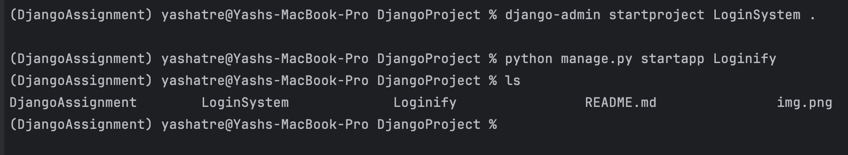

## Task-2 Screen shots:
1. Hello world route

    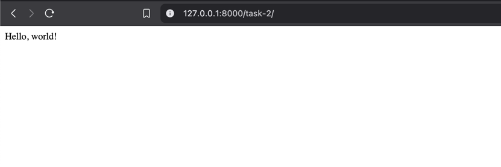
2. URL pattern
   
    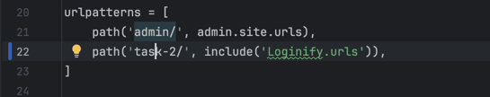
3. Postman confirmation

    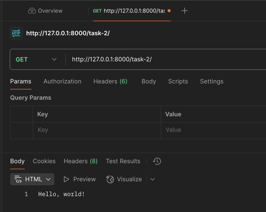

## Task-3 Screen shots:
1. Signup

   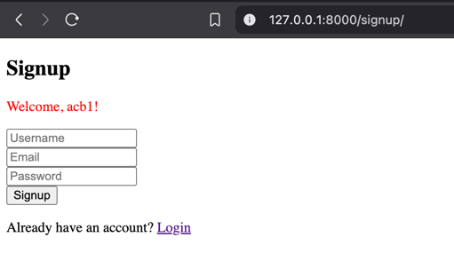
2. Login

   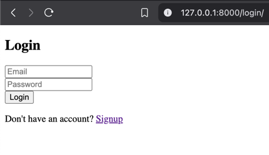
3. Login Success

   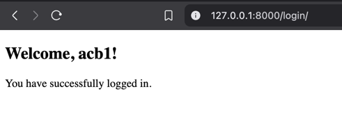
4. UserDetails model

   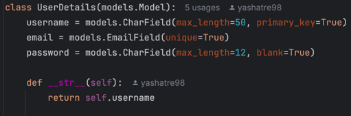
5. URL patterns

   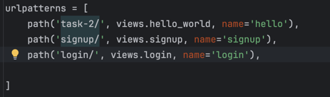

## Task-4 Screen shots:
1. Setup Superuser

   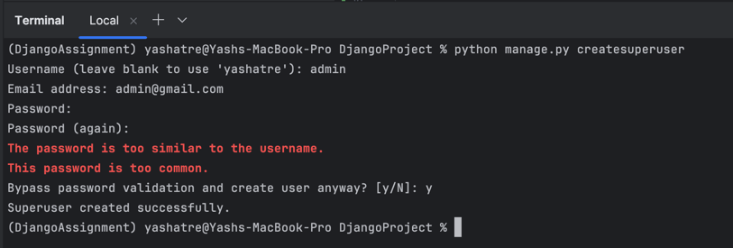
2. admin setup

   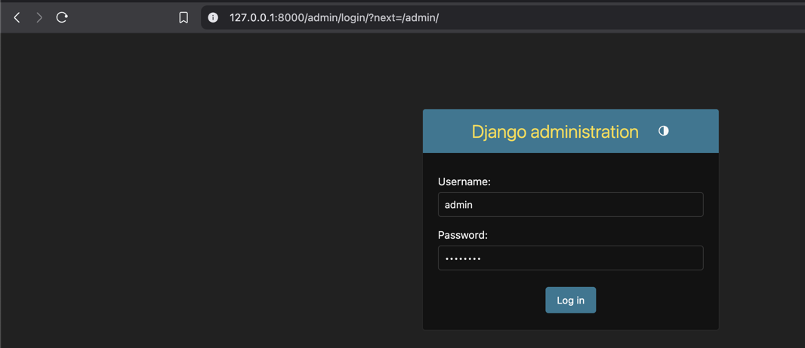
3. admin login

   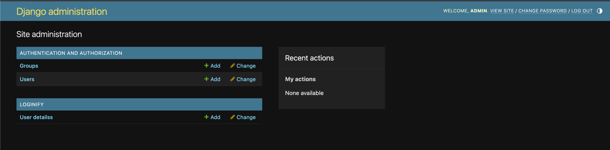
4. Django shell Screen shots (1-8)

   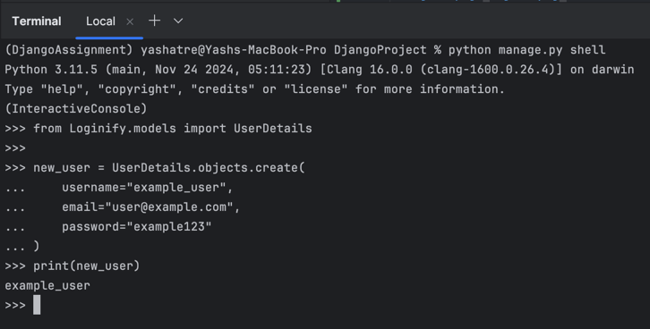

   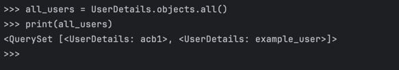

   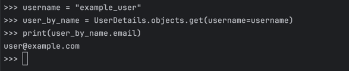

   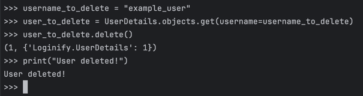

   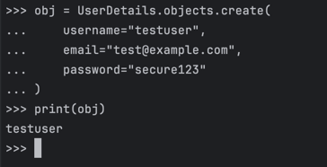

   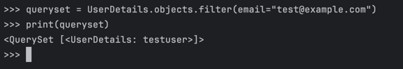

   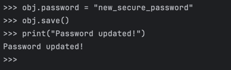

   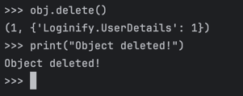

## Task-5 Screen shots:

1. get all users

   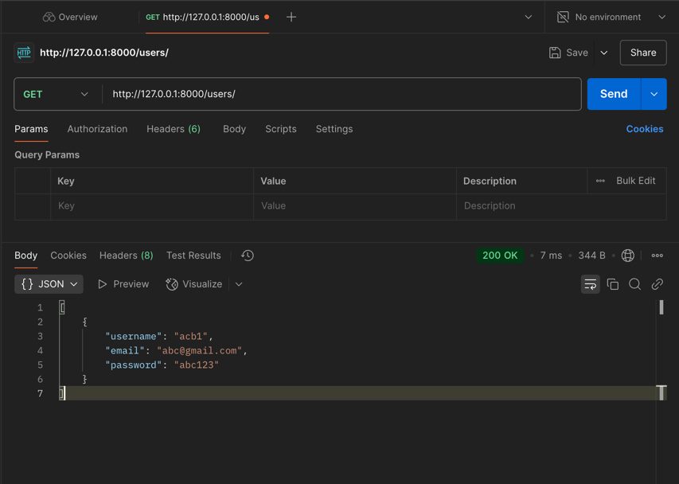
2. get user by email

   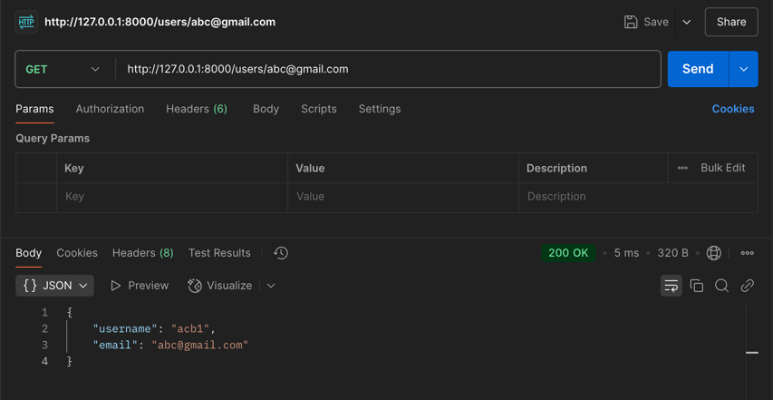
3. update user

   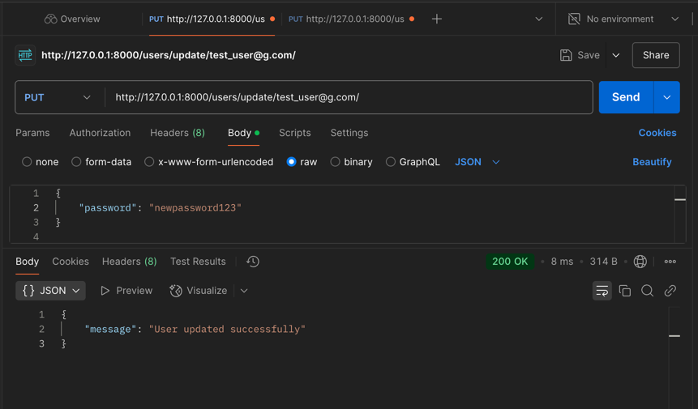
4. delete user

   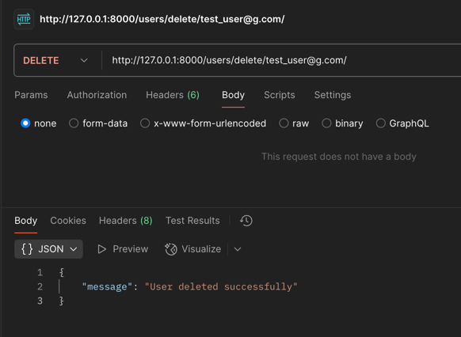